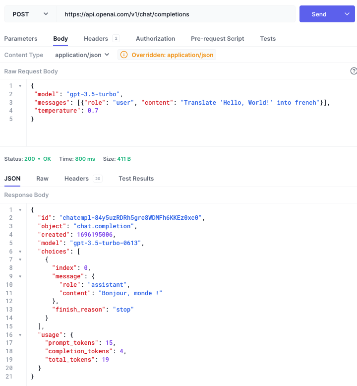

# CSC207-Project
**_Project for CSC207 Survivors_**

## Project domain:
  
A text-based adventure game inspired by Dungeons & Dragons, where the player can decide to take actions with certain percent of likelihood with randomly generated names and events the [ChatGPT API](https://platform.openai.com/docs). This project can be thought as a memory for a ChatGPT text-based adventure game where the program provides the framework which allows ChatGPT to generate a continuous, coherent, interesting story.

## Software Specification:
- Users can create new characters
- They can create new games for a chosen character
- Users can choose a class and background for their character, providing them with initial stats
- User can input prompts that ChatGPT will process and respond to
- ChatGPT created narratives, locations and characters
- Locations, general narrative and more are generated by ChatGPT, in a fairly random way to ensure new experiences
- The general narrative is continuous and players can refer back to previous messages
- Users can interact with the inventory and see what they possess
- Random encounters with monsters to fight, generating experience points and levels the character up
- Ability to save the game and load the progress

## User Stories:
1.	Katharine starts up a new game on the program. The game prompts her to type in her name and to choose which class she wants to be a part of.
2.	A new game starts with a level 1 player named Katharine who is part of the warrior class. She starts out with an empty inventory and the initial stats of a warrior. 
3.	Katharine gets a story prompt and action options. She decides to do an action. Based on her stats and luck, she gets a new text prompt describing the result.
4.	Player Katharine just killed a monster. She gained enough experience points to level up from level 1 to level 2. She was awarded with a skill point that can be added to increase the level of her skills.
5.	While exploring, Katharine stumbles upon a treasure chest. She decides to attempt to open it. The game simulates the action, and there is a chance that the chest contains valuable loot or poses a trap. Katharine takes her chances and tries to open the chest, eagerly awaiting the outcome.

## Plans

See both the early [plan of the views](Early-views.png) and an early [plan for the UML](UML-diagram.png).

## Technical problems blocking progress

### ChatGPT API has tiers.
As a result, being in the free tier we are limited in how many prompts we can send per minute/day.
### Limited history in ChatGPT API.
Unlike the website, the API does not have a memory of previous requests. Since we are limited not only how many prompts but the tokens (a value associated with the size and complexity of the prompt), we cannot provide ChatGPT an infinite memory of all 

## Screenshot of using a tool to try out the API:



- Example output of running Java code:

```
{
  "id": "chatcmpl-84y0YRCVN04JpDxcWar1akJJ8rfSp",
  "object": "chat.completion",
  "created": 1696194674,
  "model": "gpt-3.5-turbo-0613",
  "choices": [
    {
      "index": 0,
      "message": {
        "role": "assistant",
        "content": "Bonjour, le monde !"
      },
      "finish_reason": "stop"
    }
  ],
  "usage": {
    "prompt_tokens": 15,
    "completion_tokens": 5,
    "total_tokens": 20
  }
}
```
